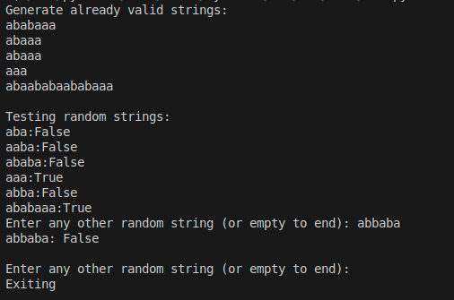

# Topic: Intro to formal languages. Regular grammars. Finite Automata.

### Course: Formal Languages & Finite Automata
### Author: Maxim Isacescu

----
## Theory
Grammar is a collection of production rules that specify how a language's valid strings can be created. Production rules, which explain changes from one form to another, variables (non-terminals), terminal symbols, and a start symbol make up a grammar.

Finite Automaton: A computational model for processing strings and identifying patterns. It is composed of an initial state, a collection of accepting states, transitions between states based on input symbols, and states. Finite automata are frequently employed in pattern matching, lexical analysis, and text processing.

## Objectives:
* Understanding formal languages and finite automata.
* Implementing the grammar and finite automata.
* Generating and validating strings based on the grammar.

## Implementation description
All the code is separated in three parts:
* Grammar class, is responsible for interpreting the grammar and generating valid strings.
* FiniteAutomaton class, is validating the input string (in our case some predefined strings and user input).
* The last part, is just the place where we declaring our grammar, calling generation and validation functions in order to test our program.

One of the important parts of the laboratory work is the code which processes a grammar's production rules and converts them into transitions for a finite automaton. It iterates over each non-terminal and its associated rules. If a rule consists of a single terminal, it creates a transition that leads to an empty string (accepting state). If a rule has a terminal followed by a non-terminal, it extracts the first symbol (terminal) and treats the remaining part as the next state. It then adds transitions mapping non-terminals and input symbols to their corresponding next states. This helps in constructing an automaton that recognizes strings based on the given grammar.
```python
for non_terminal, rules in self.P.items():
            for rule in rules:
                if len(rule) == 1 and rule in self.VT:
                    if (non_terminal, rule) not in transitions:
                        transitions[(non_terminal, rule)] = set()
                    transitions[(non_terminal, rule)].add("")
                elif len(rule) >= 1:
                    first_symbol = rule[0]  # First symbol (terminal)
                    next_state = rule[1:] if len(rule) > 1 else ""

                    if (non_terminal, first_symbol) not in transitions:
                        transitions[(non_terminal, first_symbol)] = set()
                    transitions[(non_terminal, first_symbol)].add(next_state)
```

This method, `string_validation`, checks whether a given input string is accepted by the finite automaton. It starts from the initial state and processes each symbol in the input string. For each symbol, it updates the set of possible states based on the transition rules. If at any point there are no valid next states, the function returns False, meaning the string is rejected. After processing the entire string, it checks if any of the current states belong to the set of final states. If so, the function returns True, indicating the string is accepted; otherwise, it returns False.
```python
    def string_validation(self, input_string):
        current_states = {self.start_state}
        for symbol in input_string:
            next_states = set()
            for state in current_states:
                if (state, symbol) in self.transitions:
                    next_states.update(self.transitions[(state, symbol)])
            current_states = next_states
            if not current_states:
                return False
        return bool(current_states & self.final_states)
```

Our output looks like this:




## Conclusions
In this laboratory, I've successfully implemented given grammar to create finite automata, which demonstrated the practical relationship between formal language theory and computational models. This project highlighted the main principles of automata theory.

## References
1. Lecture notes
