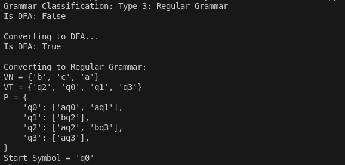

# Topic: Determinism in Finite Automata. Conversion from NDFA 2 DFA. Chomsky Hierarchy.

### Course: Formal Languages & Finite Automata
### Author: Maxim Isacescu

----
## Objectives:
* Understanding and implementing finite automata.
* Determining whether a FA is deterministic or non-deterministic.
* Implement conversion of an NDFA to a DFA.

## Theory
Finite Automata and Their Role in Process Representation
A finite automaton is a mathematical model used to represent and analyze various types of processes, particularly in computing and formal language theory. It serves as an abstract machine capable of recognizing patterns and making state transitions based on input symbols. A finite automaton can be compared to a state machine, as both share a similar structure and purpose: they operate through a finite set of states, governed by well-defined transition rules.

The term finite signifies that an automaton has a well-defined structure with a starting state and a set of final (accepting) states. This implies that every process modeled by an automaton has a clear beginning and an end, making it a useful tool for designing systems that require step-by-step decision-making, such as lexical analyzers, control circuits, and artificial intelligence models.

Finite automata can be categorized into two main types: deterministic finite automata (DFA) and non-deterministic finite automata (NFA). The difference between these lies in how they process input symbols and transition between states.

In a deterministic finite automaton (DFA), for every state and input symbol, there exists a single, unique transition to another state. This makes the automaton predictable and easy to implement in hardware or software systems.
In contrast, a non-deterministic finite automaton (NFA) allows multiple possible transitions for a single state and input symbol. This introduces an element of uncertainty, where the system can be in multiple states at the same time, requiring additional processing to determine whether a given input string is accepted.
Non-determinism often arises in real-world scenarios where multiple possible outcomes exist for the same event. In systems theory, determinism refers to the degree to which a system's behavior can be predicted given its initial state and input. A completely deterministic system follows strict rules without randomness, whereas a non-deterministic system introduces some level of unpredictability. If random variables influence transitions, the system can even become stochastic, meaning it follows probabilistic rather than deterministic behavior.

Although non-determinism can be more expressive and flexible, deterministic automata are easier to implement in computational systems. Fortunately, every NFA can be converted into an equivalent DFA using algorithms such as the subset construction algorithm. This transformation involves creating new states in the DFA that represent sets of NFA states, ensuring that for every input symbol, there is a unique transition for each state.

## Implementation description
* Grammar Classification Function Explanation
This function implements the Chomsky hierarchy classification for formal grammars. The code starts by assuming the grammar satisfies all grammar types (`is_type_3_right = True`, `is_type_3_left = True`, `is_type_2 = True`, `is_type_1 = True`) and then systematically eliminates possibilities based on rule violations. For empty productions, the function enforces that "S → ε is the only empty production" allowed in Context-Sensitive grammars, tracking this with `has_empty_production` and setting `is_type_1 = False` if multiple empty productions are found. The Type 2 (Context-Free) check requires each left-hand side to be "a single non-terminal" (`len(lhs) != 1 or lhs not in self.VN`). For Type 3 classification, the code examines both right-linear and left-linear forms - right-linear requires that "all symbols are terminals except possibly the last one" (`if any(c in self.VN for c in rule[:-1]): is_type_3_right = False`), while left-linear demands the "first symbol may be non-terminal, rest must be terminals" (`if len(rule) > 1 and (rule[0] not in self.VN or any(c in self.VN for c in rule[1:])): is_type_3_left = False`). Finally, the function returns the most restrictive classification that applies, checking Type 3 first and falling back to increasingly less restrictive types, ending with "Type 0: Unrestricted Grammar" as the default.

* Implementing deterministic checker
This function `is_deterministic()` determines whether a finite automaton is deterministic by analyzing its transition structure. The code systematically examines each state-symbol pair to verify deterministic behavior. For each state in `self.states` and each symbol in `self.alphabet`, the function handles two distinct cases: composite states (represented as frozen sets) and regular states. When dealing with composite states, typically seen in DFAs constructed from NFAs, the function checks if "len(self.transitions[(state, symbol)]) != 1" - a deterministic automaton must have exactly one transition for each state-symbol pair. For regular states in the original automaton, it verifies that "len(self.transitions[(state, symbol)]) > 1" never occurs, as multiple transitions for a single state-symbol pair would make the automaton non-deterministic. The function gracefully handles missing transitions with "if (state, symbol) not in self.transitions: continue", allowing states to lack transitions for certain symbols without affecting determinism. After examining all possible state-symbol pairs, the function returns `True` only if all deterministic criteria are met throughout the automaton, confirming its deterministic nature.

* The conversion NFA to DFA
This `convert_to_dfa()` function implements the subset construction algorithm to transform a non-deterministic finite automaton (NFA) into its equivalent deterministic finite automaton (DFA). The code begins by initializing empty sets for the DFA components (`dfa_states`, `dfa_transitions`, `dfa_final_states`) and starts the construction with the NFA's start state, creating a `start_state_set = frozenset([self.start_state])`. It employs a breadth-first approach with `unmarked_states = [start_state_set]` to systematically process all reachable state combinations. For each state set, the algorithm determines if it should be marked as final by checking if "any(state in self.final_states for state in current_state_set)". The core conversion happens as the function processes each alphabet symbol, where it computes the combined transitions with `next_state_set.update(self.full_transitions[(state, symbol)])` to determine where the NFA could move from the current state set on a given symbol. Each discovered state set becomes a single DFA state, represented as a frozen set for immutability. The transitions are built incrementally with `dfa_transitions[(current_state_set, symbol)] = {next_state_set}`, and newly discovered state sets are added to `unmarked_states` for further processing. The function elegantly handles the case of no transitions with `if not next_state_set: continue`. Upon completion of the subset construction, the function returns a new `FiniteAutomata` object representing the equivalent DFA with the constructed components.

Our output looks like this:

## Conclusions
Finite automata are fundamental tools in computer science and formal language theory, enabling the modeling of sequential processes, pattern recognition, and decision-making systems. The distinction between deterministic and non-deterministic automata plays a key role in how these systems are designed and optimized. While non-determinism introduces flexibility and expressiveness, determinism ensures predictability and ease of implementation. The ability to convert NFAs into DFAs allows us to harness the advantages of both models, making finite automata an essential concept in automata theory and its applications.

## References
1. Lecture notes
