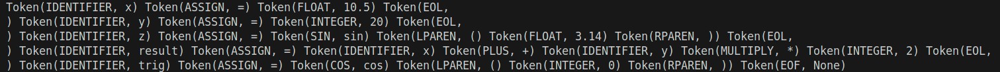

# Laboratory Work #3: Lexer & Scanner

### Course: Formal Languages & Finite Automata
### Author: Isacescu Maxim, FAF-231
### Professors: Cretu Dumitru, Irina Cojuhari

----

## Theory

Lexical analysis, commonly carried out by a lexer (also called a scanner or tokenizer), serves as the initial stage of a compiler or interpreter. Its primary function is to transform a sequence of characters into a sequence of tokens—the fundamental meaningful units of a source program.

The lexer processes input characters one at a time, detects patterns, and generates tokens. Each token consists of a token type and, optionally, a token value. In most programming languages, common token types include identifiers, keywords, operators, and literals.

Lexical analysis is usually implemented using finite automata. Patterns to be recognized (such as identifiers or numeric values) are often defined using regular expressions, which can be converted into finite automata. The lexer then employs these automata to match patterns within the input stream.

In modern language processing, lexical analysis plays a crucial role by simplifying parsing, organizing characters into meaningful tokens, handling whitespace, and often tracking source positions for effective error reporting.

## Objectives:

1. Understand what lexical analysis is and what it can be used for.
2. Get familiar with the inner workings of a lexer/scanner/tokenizer.
3. Implement a sample lexer and showcase its functionality.


## Implementation
### Token Types
```python
    ASSIGN = 'ASSIGN'
    INTEGER = 'INTEGER'
    FLOAT = 'FLOAT'
    IDENTIFIER = 'IDENTIFIER'
    EOF = 'EOF'
    EOL = 'EOL'

    PLUS = 'PLUS'
    MINUS = 'MINUS'
    MULTIPLY = 'MULTIPLY'
    DIVIDE = 'DIVIDE'
    SIN = 'SIN'
    COS = 'COS'
    LPAREN = 'LPAREN'
    RPAREN = 'RPAREN'
```
The listed token types represent the fundamental building blocks of a lexer designed to process mathematical expressions or a domain-specific language. **ASSIGN** signifies an assignment operation, typically associating a value with an identifier. **INTEGER** and **FLOAT** represent numerical values, distinguishing between whole numbers and decimal numbers. **IDENTIFIER** refers to variable names or function names within the language. **EOF** (End of File) marks the termination of input, ensuring proper parsing, while **EOL** (End of Line) helps manage line-based syntax structures. Arithmetic operations are represented by **PLUS**, **MINUS**, **MULTIPLY**, and **DIVIDE**, corresponding to basic mathematical operators. **SIN** and **COS** indicate trigonometric functions, likely allowing mathematical computations within expressions. Parentheses, **LPAREN** and **RPAREN**, define grouping in expressions, ensuring correct precedence and evaluation order. These tokens form the basis for parsing and further processing in the language.

### Lexer
The `integer()` method exemplifies the lexer's nuanced numeric parsing capabilities. This method tackles the complex challenge of recognizing numeric literals across multiple formats. Consider its handling of numeric representations:
```python
def integer(self):
    result = ''
    is_float = False
    
    if self.current_char == '-':
        result += self.current_char
        self.move_forward()
    
    while self.current_char is not None and self.current_char.isdigit():
        result += self.current_char
        self.move_forward()
    
    if self.current_char == '.':
        is_float = True
        result += self.current_char
        self.move_forward()
        
        while self.current_char is not None and self.current_char.isdigit():
            result += self.current_char
            self.move_forward()
    
    return Token(TokenType.FLOAT if is_float else TokenType.INTEGER, 
                float(result) if is_float else int(result))
```

The method's sophistication lies in its ability to dynamically determine the numeric type. It seamlessly handles negative numbers, integers, and floating-point values through a precise multi-stage parsing approach. The logic first checks for a potential negative sign, collects integer digits, and then optionally processes a decimal component, ultimately converting the parsed string to the appropriate numeric type.
Equally intricate is the `identifier()` method, which manages the extraction of variable and function names:
```python
def identifier(self):
    result = ''
    while (self.current_char is not None and 
           (self.current_char.isalnum() or self.current_char == '_')):
        result += self.current_char
        self.move_forward()

    if result == 'sin':
        return Token(TokenType.SIN, result)
    elif result == 'cos':
        return Token(TokenType.COS, result)

    return Token(TokenType.IDENTIFIER, result)
```

This method demonstrates a flexible parsing strategy that accommodates complex naming conventions. It allows alphanumeric characters and underscores while implementing special recognition for trigonometric function keywords like `sin` and `cos`.
The pinnacle of the lexer's complexity resides in the `get_next_token()` method, which serves as the primary tokenization engine:
```python
def get_next_token(self):
    while self.current_char is not None:
        if self.current_char.isspace():
            if self.current_char == '\n':
                self.move_forward()
                return Token(TokenType.EOL, '\n')
            self.skip_whitespace()
            continue

        if self.current_char.isdigit() or self.current_char == '-':
            return self.integer()
        if self.current_char.isalpha():
            return self.identifier()
        
        # ... (operator and symbol handling)

        self.error()
    return Token(TokenType.EOF, None)
```

This method orchestrates a complex decision tree, systematically processing input characters. It handles diverse scenarios: numeric literals, identifiers, whitespace, newlines, and various operators. The method's design allows for sequential token extraction, with each iteration making context-aware decisions about the next token's type.

This approach enforces a clean, fail-fast mechanism that immediately signals parsing issues, preventing the generation of partially processed or corrupted token streams.
The parsing strategy fundamentally relies on the `move_forward()` method, which incrementally advances through the input text:
```python
def move_forward(self):
    self.pos += 1
    self.current_char = self.text[self.pos] if self.pos < len(self.text) else None
```

This method encapsulates the lexer's navigation mechanism, seamlessly transitioning between characters and handling input termination.Through these interconnected methods, the lexer transforms raw text into a meaningful sequence of tokens, bridging the gap between textual representation and structured data interpretation.

## Input and Output
Input:
```
x = 10.5
y = 20
z = sin(3.14)
result = x + y * 2
trig = cos(0)
```

Output:



## Conclusions
Through this laboratory work, I have gained a deeper understanding of lexical analysis and its significance in language processing. By implementing a music notation lexer, I explored how characters can be grouped into meaningful tokens based on predefined patterns. This experience highlighted several key insights: lexical analysis fundamentally relies on pattern recognition, position tracking is crucial for meaningful error reporting, a well-designed token system simplifies subsequent processing stages, and lexers can be applied to various domain-specific languages beyond traditional programming languages. The lexer serves as the foundational step in developing a music language processor, which could be further extended with a parser, semantic analyzer, and interpreter to create a complete music programming language.

## References:
[1] [A sample of a lexer implementation](https://llvm.org/docs/tutorial/MyFirstLanguageFrontend/LangImpl01.html)

[2] [Lexical analysis](https://en.wikipedia.org/wiki/Lexical_analysis)