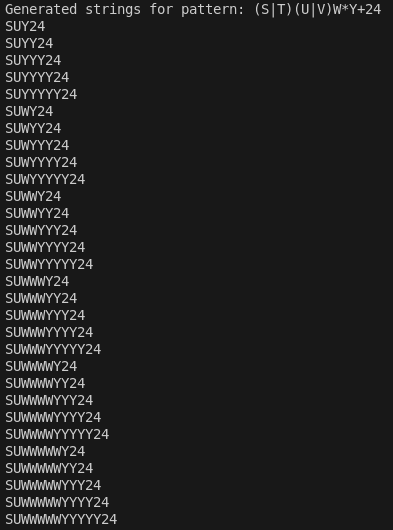
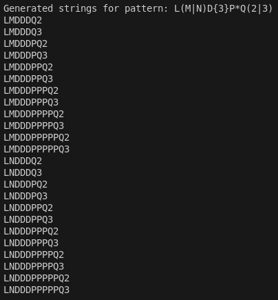
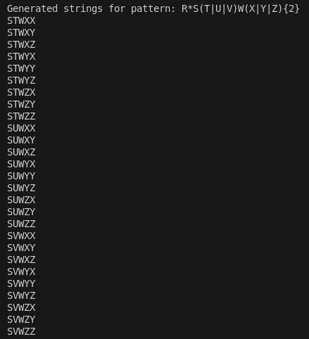

# Laboratory Work #4: Regular expressions
### Course: Formal Languages & Finite Automata
### Author: Isacescu Maxim, FAF-211
Variant: 4

## Theory
A regex pattern generator is a computational tool designed to interpret structured patterns and produce all valid strings that conform to the specified rules. Unlike traditional regex engines that match patterns in existing text, this generator operates inversely, creating strings based on the pattern’s syntax. The core constructs it processes include groups, quantifiers, and repeats. Groups, denoted as `(A|B)`, define alternative elements, allowing the generator to branch into multiple string possibilities. Quantifiers such as `?` (optional, 0 or 1 occurrence), `*` (Kleene star, 0 to n occurrences), and `+` (positive closure, 1 to n occurrences) introduce variability in repetition. Fixed repeats like `{3}` enforce exact duplication of preceding elements. The generator also handles multi-digit literals (e.g., `24`) as atomic units. Underlying this process is the principle of Cartesian products, where combinations of parsed components are systematically expanded to generate exhaustive string permutations within predefined bounds, ensuring computational feasibility.

## Objectives
a. Write a code that will generate valid combinations of symbols conform given regular expressions (examples will be shown). Be careful that idea is to interpret the given regular expressions dinamycally, not to hardcode the way it will generate valid strings. You give a set of regexes as input and get valid word as an output    
b. In case you have an example, where symbol may be written undefined number of times, take a limit of 5 times (to evade generation of extremely long combinations);

## Implementation
The program defines a RegexMachine class that serves as a miniature regular expression parser and generator. It interprets a simplified pattern language consisting of grouping, quantifiers, fixed-length repetition, and literal sequences. At the beginning, `MAX_REPEAT = 5` sets a cap on how many times a character can repeat when using `*` or `+` quantifiers.

One of the foundational tools is `find_matching(start, open_char, close_char)`, which scans the pattern to find the corresponding closing character (like `)` or `}`), properly handling nesting. It increments or decrements a depth counter (`if self.pattern[i] == open_char: depth += 1`) and returns the index where `depth == 0`, i.e., the matching closer.
```python
def find_matching(self, start, open_char, close_char):
    depth = 0
    for i in range(start, len(self.pattern)):
        if self.pattern[i] == open_char:
            depth += 1
        elif self.pattern[i] == close_char:
            depth -= 1
            if depth == 0:
                return i
    raise ValueError(f"Unmatched {open_char}")
```

The core of the parser lies in `parse_pattern()`, which iterates character-by-character over the pattern. For groups like `(A|B)`, it uses `self.find_matching(i, '(', ')')` to locate the group’s end, then splits it with `.split('|')` and appends the resulting list to parts. For fixed-length repetitions like `{3}`, it detects the repetition count with `repeat = int(self.pattern[i + 1:end])` and applies it to the preceding segment. If that segment is a group (e.g., `['X', 'Y', 'Z']`), it uses a nested list comprehension (`repeated = [r + [c] for r in repeated for c in last]`) to compute the full Cartesian product; if it’s a single element, it performs a simple repeat with `parts.append([last[0] * repeat])`.

Quantifiers like `?`, `*`, and `+` are handled by detecting a character followed by one of those symbols (`elif i + 1 < len(self.pattern`) and `self.pattern[i + 1] in '?*+')`. The expansion logic is concise and clever: `? becomes [base, '']`, `*` generates `[base * j for j in range(0, self.MAX_REPEAT + 1)]`, and `+` starts from 1 instead of 0. The parser also recognizes multi-digit numbers as single tokens using a loop: `while i < len(self.pattern)` and `self.pattern[i].isdigit(): i += 1`.

```python
elif i + 1 < len(self.pattern) and self.pattern[i + 1] in '?*+':
    symbol = self.pattern[i + 1]
    base = self.pattern[i]
    if symbol == '?':
        parts.append([base, ''])
    elif symbol == '*':
        parts.append([base * j for j in range(0, self.MAX_REPEAT + 1)])
    elif symbol == '+':
        parts.append([base * j for j in range(1, self.MAX_REPEAT + 1)])
    i += 2
```

Once parsing is complete, the `product()` static method takes over. It computes all combinations of parsed parts using nested loops: for prefix in result: for item in part: `temp.append(prefix + item)`. This produces a Cartesian product across all pattern segments, enabling exhaustive enumeration of possible strings.
```python
def product(parts):
    if not parts:
        return []
    result = ['']
    for part in parts:
        temp = []
        for prefix in result:
            for item in part:
                temp.append(prefix + item)
        result = temp
    return result
```

The `generate_results()` method wraps this into a generator using `yield ''.join(combination)` to produce results one-by-one. The `process()` method connects everything: it prints the pattern, calls `parse_pattern()`, and iterates through `generate_results()` to print each generated string.

The bottom of the script contains example usage. A list of patterns like `(S|T)(U|V)W*Y+24` and `R*S(T|U|V)W(X|Y|Z){2}` is defined. For each, a RegexMachine object is created and `process()` is called: `[machine.process() for machine in machines]`. This causes all matching strings for each pattern to be printed, illustrating the engine’s full power.

## Results








## Conclusions
This project underscores the intersection of formal language theory and practical computation. By implementing a regex pattern generator, the work highlights how finite automata concepts—such as state transitions for parsing and combinatorial expansions—can be applied to solve real-world problems. The generator successfully handles complex patterns, though limitations arise from the `MAX_REPEAT` constraint, which truncates infinite quantifiers. Future enhancements could support advanced regex features like lookaheads or backreferences. The utility of such a tool spans automated testing, fuzzing, and educational demonstrations of formal language properties. Ultimately, the project reinforces the importance of structured parsing and combinatorial logic in computational linguistics.


