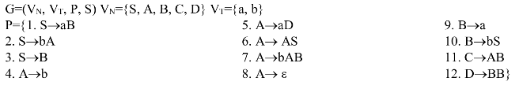
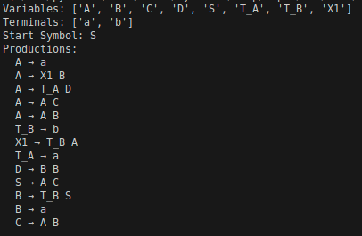

# Laboratory Work #5: Chomsky Normal Form
### Course: Formal Languages & Finite Automata
### Author: Isacescu Maxim, FAF-231
### Professors: Cretu Dumitru, Irina Cojuhari

## Theory
In formal language theory, Chomsky Normal Form (CNF) is a standardized representation of context-free grammars (CFGs) where every production rule strictly conforms to one of two formats: either a non-terminal producing exactly two non-terminals (e.g., `A → B C`), or a non-terminal producing a single terminal (e.g., `A → a`). This restricted form simplifies parsing algorithms, such as the CYK algorithm, and facilitates formal analysis of languages. Converting a general CFG into CNF requires a sequence of transformations to eliminate ε-productions (productions that generate the empty string), unit productions (e.g., `A → B`), and useless symbols, followed by restructuring rules into the required binary or terminal forms.

## Objectives
1. Learn about Chomsky Normal Form (CNF).
2. Get familiar with the approaches of normalizing a grammar.
3. Implement a method for normalizing an input grammar by the rules of CNF. The implementation needs to be encapsulated in a method with an appropriate signature (also ideally in an appropriate class/type). The implemented functionality needs executed and tested.

## Implementation
The implementation of the Grammar class focuses on systematically converting a context-free grammar (CFG) into Chomsky Normal Form (CNF), a process that involves eliminating or restructuring productions that violate CNF’s strict rules. The `to_cnf()` method acts as the orchestrator, invoking four key transformations in sequence: removing ε-productions, eliminating unit productions, pruning useless symbols, and restructuring rules into binary form. Each step is supported by code that directly manipulates the grammar’s variables, terminals, and production rules, ensuring compliance with CNF requirements.

The `remove_null_productions()` method begins by identifying nullable variables—those that can derive the empty string (ε). This is done through a fixed-point iteration that starts with variables explicitly producing ε (detected via () in `self.productions.get(var, [])`) and expands the set by checking rules where all symbols are nullable. For example, if a rule like `A → B C` exists and both `B` and `C` are nullable, `A` is added to the nullable set. The code then rebuilds all affected rules by generating permutations of each production with nullable symbols omitted. This combinatorial process uses bitmasking to iterate through all possible subsets of nullable positions in a rule:

```python
positions = [i for i, sym in enumerate(rule) if sym in nullable]  
for i in range(1 << len(positions)):  
    new_rule = list(rule)  
    for j, pos in enumerate(positions):  
        if (i >> j) & 1:  # Toggle inclusion of nullable symbol  
            new_rule[pos] = None  
    filtered = tuple(sym for sym in new_rule if sym is not None)
```

For a rule like `A → B C D` where `B` and `D` are nullable, this generates variants such as `A → C D`,` A → B C`, and `A → C`, ensuring no valid derivations are lost while removing ε-productions. The use of bitwise operations (`1 << len(positions)`) ensures exhaustive coverage of all combinations, while filtered removes placeholders (`None`) to form valid rules.

Unit productions (e.g., `A → B`) are addressed in `remove_unit_productions()`, which first identifies direct unit pairs using a set comprehension:

```python
unit_pairs = {(var, rule[0]) for var in self.variables for rule in self.productions[var]  
              if len(rule) == 1 and rule[0] in self.variables}  
```
This captures rules where a variable maps directly to another variable. The method then computes the transitive closure of these pairs to account for indirect unit relationships (e.g., `A → C` if `A → B` and `B → C` exist). This is achieved through a loop that iteratively expands the set of unit pairs until no new pairs are added, ensuring all possible unit chains are resolved. Once the closure is complete, the original unit rules are removed, and the target variable’s non-unit productions are merged into the source variable’s rules. For example, if `A → B` and `B → "terminal"`, the unit rule `A → B` is discarded, and `A → "terminal"` is added directly. This step ensures that all remaining rules either produce terminals or multiple non-terminals, eliminating redundant indirection.

The `remove_useless_symbols()` method streamlines the grammar by removing variables that cannot generate terminal strings (non-generating) or are unreachable from the start symbol (non-reachable). Generating symbols are identified by checking if a variable has at least one rule composed entirely of terminals, as seen in the condition `any(all(sym in self.terminals for sym in rule) for rule in self.productions.get(var, [])`. For example, a variable `A` with a rule` A → a` is marked generating. Reachability is determined via a breadth-first search (BFS) starting from the start symbol, traversing all variables accessible through production rules:

```python
queue = [self.start_symbol]  
while queue:  
    current = queue.pop()  
    reachable.add(current)  
    for rule in self.productions.get(current, []):  
        for sym in rule:  
            if sym in self.variables and sym not in reachable:  
                queue.append(sym)
```

This traversal ensures only variables connected to the start symbol are retained. The final step intersects generating and reachable variables, pruning those that fail either criterion. For instance, a variable `C` that is only used in a rule like `B → C` but cannot produce terminals itself would be removed, along with all rules referencing it.

The `convert_to_cnf_format()` method enforces CNF’s structural requirements by replacing terminals in multi-symbol rules with proxy non-terminals (e.g., `T_A → a`) and breaking longer rules into binary productions. Terminals are isolated using a term_map dictionary to track proxy variables, preventing redundant creations:

```python
if sym in self.terminals:  
    if sym not in term_map:  
        new_var = f"T_{sym.upper()}"  
        while new_var in self.variables or new_var in new_vars:  
            new_var += "_"  
        term_map[sym] = new_var  
        new_productions[new_var] = [(sym,)]  
    new_rule.append(term_map[sym])
```

This ensures that `a` terminal like `a` in a rule `A → B a C` is replaced with `T_A`, yielding `A → B T_A C`. Rules longer than two symbols are then recursively split using intermediate variables like `X1`, `X2`, etc. For a rule `A → B C D`, the loop:

```python
while len(new_rule) > 2:  
    new_var = f"X{len(new_vars)}"  
    new_productions[new_var] = [(new_rule[0], new_rule[1])]  
    new_rule = [new_var] + new_rule[2:]
```

reduces it to `A → X1 D` and `X1 → B C`, ensuring all productions are strictly binary. The use of `new_vars` to track intermediate variables guarantees unique names, avoiding conflicts with existing symbols.

Throughout this process, the grammar’s integrity is maintained by updating self.variables and self.productions at each step. The final result, accessible via `print_grammar()`, ensures all rules conform to CNF’s constraints, either producing a single terminal or exactly two non-terminals. This transformation not only standardizes the grammar for algorithms like CYK parsing but also preserves the language’s expressiveness by systematically addressing structural deviations. By leveraging combinatorial logic, transitive closures, and iterative pruning, the code ensures robustness and efficiency, handling edge cases such as nullable symbol permutations, indirect unit dependencies, and terminal isolation with precision.

## Results


Input (V18):



Output:




## Conclusions
Converting a context-free grammar to Chomsky Normal Form is a fundamental step in formal language processing, enabling efficient parsing and analysis by standard algorithms. By systematically eliminating null, unit, and useless productions and restructuring rules into binary or terminal forms, any valid grammar can be normalized into CNF. This structured approach not only simplifies the grammar's structure but also lays the groundwork for further computational applications like syntax analysis, parsing, and automaton construction.

