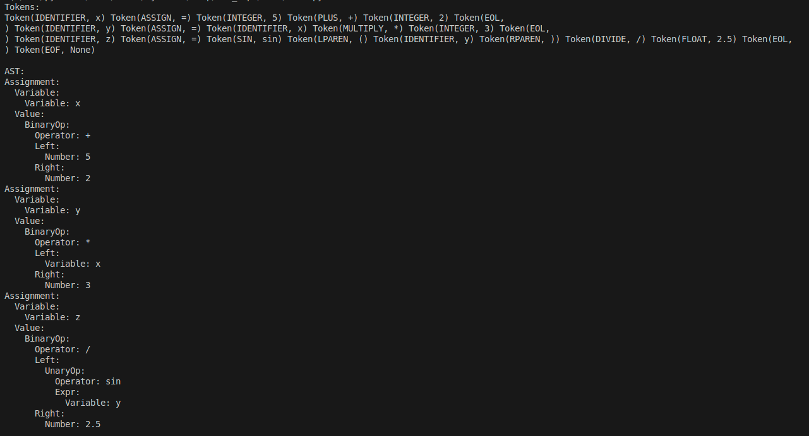

# Laboratory Work #6: Parser & Building an Abstract Syntax Tree
### Course: Formal Languages & Finite Automata
### Author: Isacescu Maxim, FAF-231
### Professors: Cretu Dumitru, Irina Cojuhari

## Theory
In the field of compiler construction and formal language theory, parsing serves as a critical step that bridges the gap between raw input and meaningful interpretation. After lexical analysis breaks down a source code into tokens, parsing takes these tokens and structures them according to the rules of a formal grammar, usually defined in a context-free grammar (CFG). The result of this analysis is often a parse tree—a hierarchical tree structure that captures the full syntactic structure of the input based on the production rules of the grammar. Parse trees are essential for visualizing how input strings conform to grammatical rules, making them valuable for both theoretical understanding and practical debugging of language parsers.

## Objectives
1. Get familiar with parsing, what it is and how it can be programmed.   
2. Get familiar with the concept of AST.   
3. In addition to what has been done in the 3rd lab work do the following: in case you didn't have a type that denotes the possible types of tokens you need to:   
  - Have a type TokenType (like an enum) that can be used in the lexical analysis to categorize the tokens.   
  - Please use regular expressions to identify the type of the token.   
  - Implement the necessary data structures for an AST that could be used for the text you have processed in the 3rd lab work.   
  - Implement a simple parser program that could extract the syntactic information from the input text.   

## Implementation
The code implements a lexer and parser for a simple mathematical language, transforming raw text input into structured tokens and then into an abstract syntax tree (AST) that captures the hierarchical relationships of operations, assignments, and function calls. At its core, the lexer uses regular expressions to scan the input text, identifying and categorizing elements like numbers, operators, parentheses, identifiers (variables), and keywords such as `sin` and `cos`. For instance, it distinguishes between integers (e.g., `-42`) and floats (e.g., `3.14`) while skipping irrelevant whitespace. Newline characters (`\n`) are explicitly tracked to support multi-line input and improve error reporting. The lexer’s tokenization process is prioritized by the order of regex patterns, ensuring that specific constructs like trigonometric functions are recognized before generic identifiers, preventing misclassification. For example, the regex `r'sin\b'` ensures that sin is treated as a keyword rather than a variable name like sine.

```python
token_patterns = [  
    (r'[ \t]+', None),  # skip whitespace  
    (r'\n', TokenType.EOL),
    (r'=', TokenType.ASSIGN),  
    (r'\(', TokenType.LPAREN),  
    (r'\)', TokenType.RPAREN),  
    (r'\+', TokenType.PLUS),  
    (r'-', TokenType.MINUS),  
    (r'\*', TokenType.MULTIPLY),  
    (r'/', TokenType.DIVIDE),  
    (r'sin\b', TokenType.SIN),  
    (r'cos\b', TokenType.COS),  
    (r'-?\d+\.\d+', TokenType.FLOAT),  # floats  
    (r'-?\d+', TokenType.INTEGER),  # integers  
    (r'[a-zA-Z_][a-zA-Z0-9_]*', TokenType.IDENTIFIER),  # identifiers  
]  
```

The parser then takes these tokens and constructs an AST using recursive descent, a top-down parsing technique that mirrors the grammar rules of the language. It handles operator precedence and associativity implicitly through the structure of its methods. For example, the expr method parses addition and subtraction, while the term method handles multiplication and division, ensuring that expressions like `3 + 4 * 2` are parsed correctly as `3 + (4 * 2)`. The parser also manages nested parentheses by recursively invoking the expr method when encountering `(`, allowing complex expressions like `(5 - 3) * sin(0.5)` to be decomposed into their constituent parts. Function calls like `sin(3.14)` are parsed as unary operations, where the `function_call` method captures the function name, consumes the opening parenthesis, parses the inner expression, and validates the closing parenthesis, ultimately generating a `UnaryOpNode` to represent the operation in the AST.

```python
def expr(self):  
    node = self.term()  
    while self.current_token.type in (TokenType.PLUS, TokenType.MINUS):  
        op = self.current_token  
        self.eat(op.type)  
        node = BinaryOpNode(node, op, self.term())  
    return node  

def term(self):  
    node = self.factor()  
    while self.current_token.type in (TokenType.MULTIPLY, TokenType.DIVIDE):  
        op = self.current_token  
        self.eat(op.type)  
        node = BinaryOpNode(node, op, self.factor())  
    return node  
```

The AST itself is composed of specialized nodes that model different language constructs. BinaryOpNode and UnaryOpNode classes represent operations like `+`, `*`, or `sin`, linking to child nodes that hold their operands or arguments. AssignNode captures variable assignments (e.g., `x = 10 + 5`), storing the target variable as a VariableNode and the computed value as a subtree of expression nodes. The AST’s structure enables straightforward traversal for downstream tasks like interpretation or compilation. For example, a print_ast function recursively formats the tree, indenting nested operations to visualize precedence and relationships, such as showing that `sin(3.14/2` is a unary operation applied to the division of `3.14` by `2`.

```python
class AssignNode(ASTNode):  
    def __init__(self, variable, value):  
        self.variable = variable
        self.value = value

class BinaryOpNode(ASTNode):  
    def __init__(self, left, op, right):  
        self.left = left
        self.op = op
        self.right = right
```

Error handling is woven into both the lexer and parser. The lexer raises exceptions for unrecognized tokens (e.g., an invalid symbol like `$`), while the parser enforces grammatical rules, such as ensuring parentheses are balanced or that assignment statements like `x =` are followed by valid expressions. The parser’s error method generates context-aware messages, such as pointing out a missing operand after an operator. Together, these components form a pipeline: the `parse_file` function reads input from a file, invokes the lexer to tokenize it, feeds the tokens to the parser, and returns both the token stream and AST for inspection. This design not only modularizes the compilation process but also facilitates debugging, as seen in the example output that prints tokens and a formatted AST, making it easier to trace how input like `x = sin(5) + 3` is parsed into a structured tree with nodes for assignment, addition, and function calls. The code’s architecture reflects foundational principles of language implementation, balancing precision in syntax rules with flexibility to handle mathematical expressions and variable assignments.

```python
def error(self, expected=None):  
    token = self.current_token  
    msg = f'Syntax error at token: {token}'  
    if expected:  
        msg += f', expected: {expected}'  
    raise Exception(msg)  
```


## Results

Input:


Output:




## Conclusions
The process of parsing, culminating in the construction of parse trees and abstract syntax trees, is central to the interpretation and compilation of structured input. Parse trees offer a complete and faithful representation of the grammar rules applied to the input, making them suitable for error detection and theoretical validation. However, for practical purposes such as semantic analysis and code transformation, abstract syntax trees provide a streamlined and semantically focused alternative that strips away syntactic noise and highlights the meaningful structure of the input. Understanding the distinctions and applications of these tree structures is key for anyone involved in compiler development, language design, or automated reasoning. They form the foundation of how machines can interpret and act upon complex symbolic input, enabling everything from simple calculators to sophisticated programming environments. As such, mastery of parsing techniques and their resulting structures is an essential skill in the broader context of language processing and formal systems.
